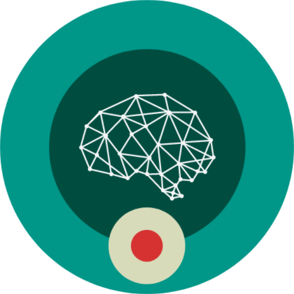

# Brec - Brain Recorder


---

An android app to view and record EEG data sent from the [Muse](http://www.choosemuse.com/) device.
BREC allows you to enter information about recordings and subjects and save everything in a .csv file in the smartphone.

## Getting Started

These instructions will get you a copy of the project up and running on your local machine for development and testing purposes. See deployment for notes on how to deploy the project on a live system.

### Prerequisites

1. [JDK](https://www3.ntu.edu.sg/home/ehchua/programming/howto/JDK_Howto.html)
2. [Node.js](https://nodejs.org/en/download/package-manager/)
3. [Yarn](https://github.com/yarnpkg/yarn)
4. [React Native](https://facebook.github.io/react-native/docs/getting-started.html)
5. [Android Studio and SDK](https://developer.android.com/studio/)
6. [Gradle Daemon](https://docs.gradle.org/2.9/userguide/gradle_daemon.html)

### Installing

1. Download the LibMuse SDK from [Muse's developer website](http://developer.choosemuse.com/android). We've already taken care of integrating the sdk library into the app, so just make sure you end place libmuse_android.so in `<clonedRepoName>/Brec_Project/BREC/android/app/src/main/jniLib/armeabi-v7a/` and libmuse_android.jar in `<clonedRepoName/Brec_Project/BREC/android/app/libs/`
2. run `sudo yarn install` in the BREC folder

## Deployment

1. Connect an Android device with USB debug mode enabled. Because the LibMuse library depends on an ARM architecture, Brec will not build in an emulator
2. Run `sudo react-native start` to start React packager
3. In new terminal, run `adb reverse tcp:8081 tcp:8081` to ensure debug server is connected to your smartphone and then `sudo react-native run-android` to install Brec


## Generating a signed APK

https://facebook.github.io/react-native/docs/signed-apk-android.html

You can generate a private signing key using `keytool`.

`$ keytool -genkey -v -keystore my-release-key.keystore -alias my-key-alias -keyalg RSA -keysize 2048 -validity 10000`

This command prompts you for passwords for the keystore and key, and to provide the Distinguished Name fields for your key. It then generates the keystore as a file called `my-release-key.keystore`.

### Setting up gradle variables

Place the `my-release-key.keystore` file under the `android/app` directory in your project folder.

Edit the file `~/.gradle/gradle.properties` or `android/gradle.properties` and add the following (replace ***** with the correct keystore password, alias and key password):

```
...
MYAPP_RELEASE_STORE_FILE=my-release-key.keystore
MYAPP_RELEASE_KEY_ALIAS=my-key-alias
MYAPP_RELEASE_STORE_PASSWORD=*****
MYAPP_RELEASE_KEY_PASSWORD=*****
```

### Adding signing config to your app's gradle config

Edit the file `android/app/build.gradle` in your project folder and add the signing config,

```
...
android {
    ...
    defaultConfig { ... }
    signingConfigs {
        release {
            if (project.hasProperty('MYAPP_RELEASE_STORE_FILE')) {
                storeFile file(MYAPP_RELEASE_STORE_FILE)
                storePassword MYAPP_RELEASE_STORE_PASSWORD
                keyAlias MYAPP_RELEASE_KEY_ALIAS
                keyPassword MYAPP_RELEASE_KEY_PASSWORD
            }
        }
    }
    buildTypes {
        release {
            ...
            signingConfig signingConfigs.release
        }
    }
}
...
```

### Generating the release APK

Simply run the following in a terminal:

```
$ cd android
$ ./gradlew assembleRelease
```

The generated APK can be found under `android/app/build/outputs/apk/app-release.apk`, and is ready to be distributed.

## Built With

* [React Native](https://facebook.github.io/react-native/) 

## Contributing

Thanks to NeuroTechX for their public project on github. -> [EEG101](https://github.com/NeuroTechX/eeg-101).

## License

This project is licensed under the MIT License - see the [LICENSE.md](LICENSE.md) file for details
